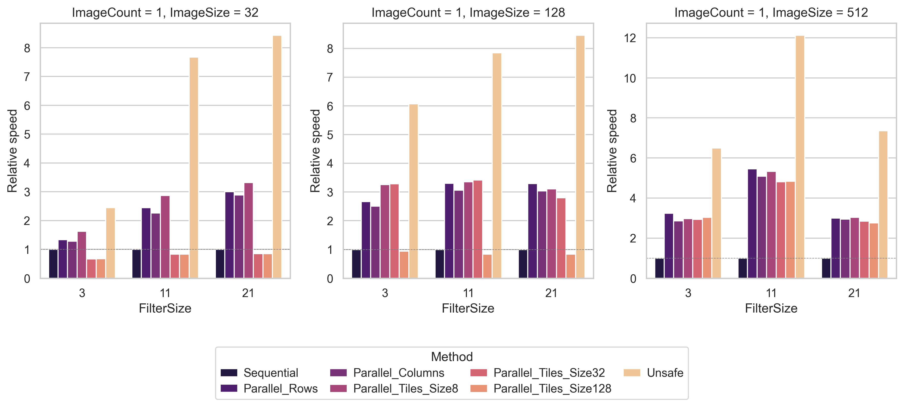
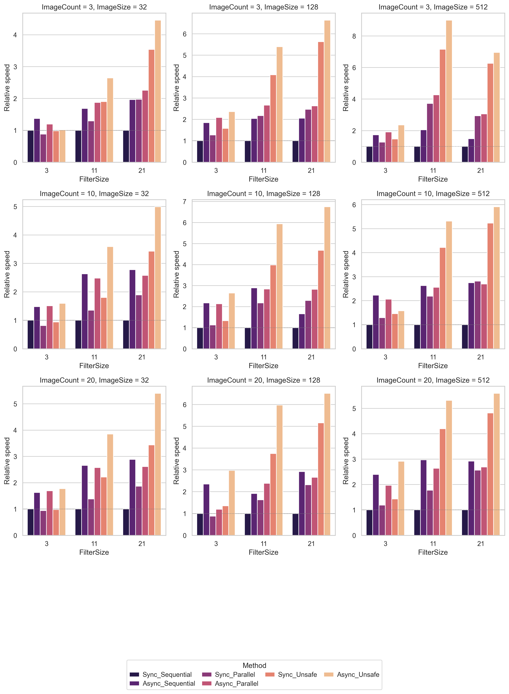
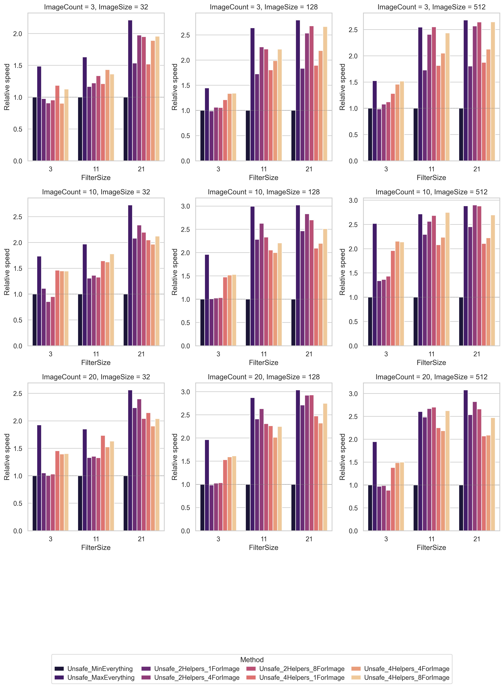

# Convolution


Image convolution implementations


## Usage


```sh
make test        # run tests
make coverage    # run tests with coverage report
make benchmark   # run benchmarks on random images
make plots       # visualize benchmark results
```

All output is written to `Artifacts/`.


## Benchmarks


`make benchmark` measures several convolution implementations across different image sizes and filter sizes
1. Compares different convolution implementations on one image
2. Compares different pipeline implementations on a stream of images
3. Compares different tunings for one pipeline implementation


## Visualization


`make plots` generates PNG charts from the last benchmark run


An example of automatically generated charts, along with a test coverage report, is (temporarily) available [here](https://prettysorrow.github.io/4th-sem-workshop/)


You can also deploy it locally with benchmark results obtained on your machine:
1. `make coverage`
2. `make benchmark`
3. `make plots`
4. `make preview` (or your way of local deployment)


## Brief analysis


> Hereinafter "unsafe" refers to a memory-access optimized parallel row-by-row image convolution implementation presented in `Convolution.Impl.Unsafe`


- Naive parallel implementation is up to 5× faster than the sequential one
    - In most cases it is about a 2×-3× advantage
- The difference between pixel access orders in the naive parallel implementation is insignificant in most cases
    - This is likely because the access was performed through the indexers of the `SixLabors.ImageSharp.Image` class, which negates the advantages of a row-by-row approach
- Unsafe implementation is much faster than other ones
    - Up to 10× advantage over the sequential approach
    - Up to 2.5× advantage over the naive parallel approaches
- .NET's way of resource distribution is better than presented manual pipeline options tunings in most cases
    - In most cases, certain tunings allow achieving performance as close as possible to that provided by the .NET runtime

#### Different implementations on one image:



#### Different pipelines:



#### Different pipeline tunings (for the unsafe implementation):



- `MinEverything` stands for pipeline with 3 workers (1 reader, 1 convolver, 1 writer) without image-level parallelism
- `MaxEverything` stands for pipeline where parallelism is not limited at any level (so resource management is entirely handled by .NET runtime)
- `Unsafe_[2N]Helpers_[M]ForImage` stand for a pipeline with up to `N` readers in total, up to `N` writers in total and up to `M` workers for a single image
